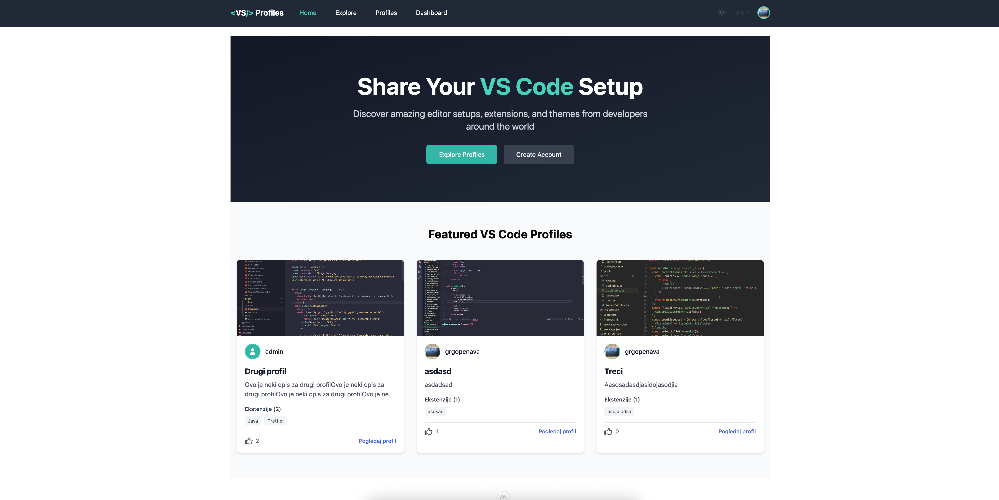
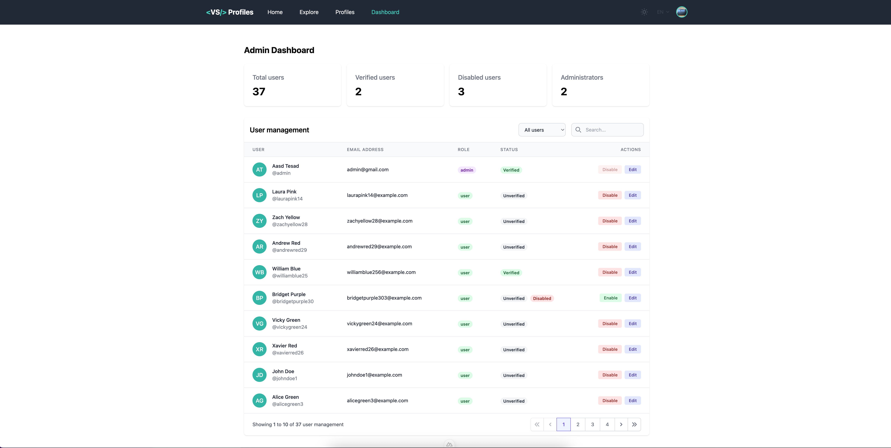
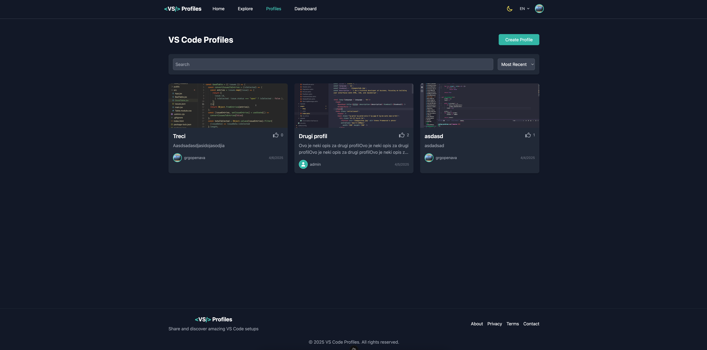
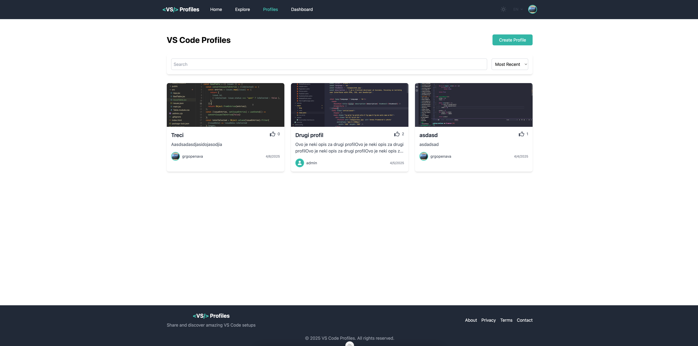
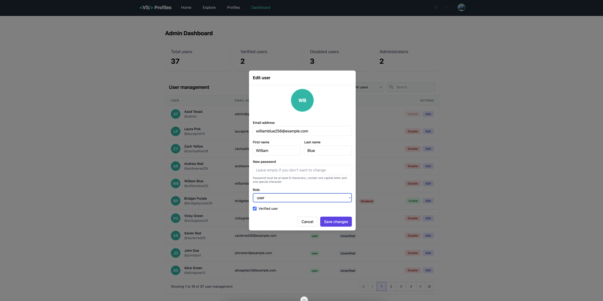
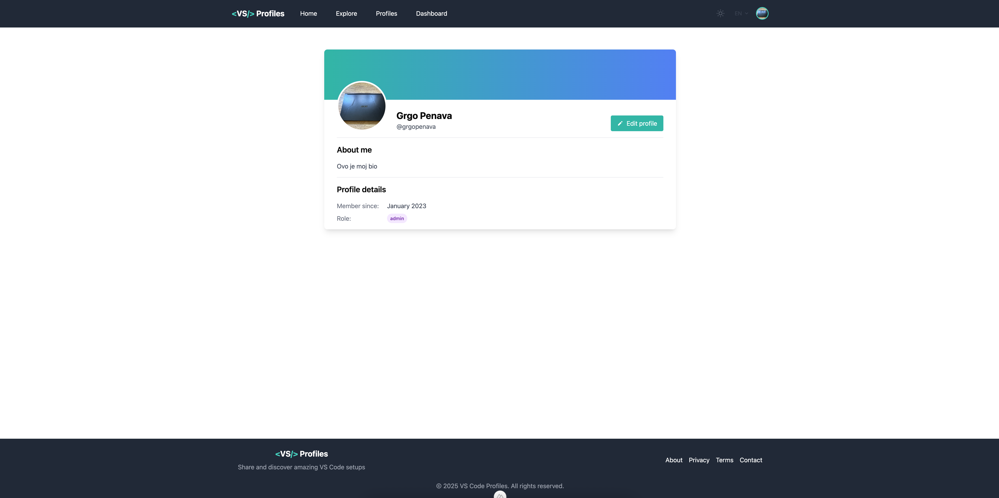
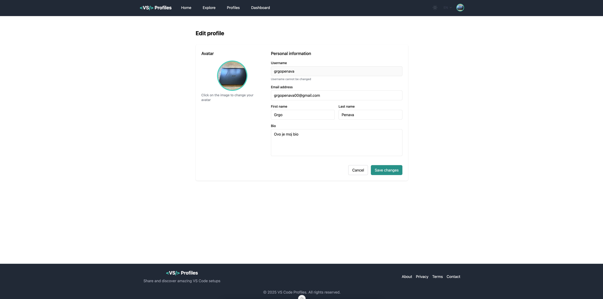
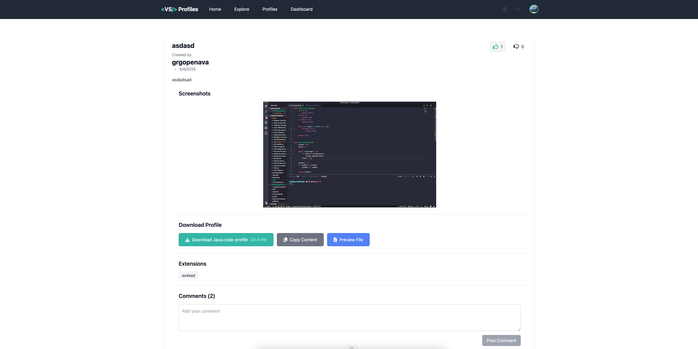

# VS Code Profiles

Web aplikacija za dijeljenje i otkrivanje VS Code postavki, ekstenzija i tema. Omogućuje developerima da dijele svoje razvojno okruženje sa zajednicom.

## 📸 Screenshots

### 🏠 Home Page


### 🇭🇷 Croatian Language – Home Page


### 📊 Dashboard View


### 🌙 Dark Mode


### 👥 User Profiles


### ✏️ Edit User


### 🧑‍💼 User Profile


### ⚙️ Edit User Profile


### 💻 VS Code Profile Example


---

## Tehnički Stack

### Frontend

- **Nuxt 3** - Vue-based full-stack framework s server-side renderingom
- **TailwindCSS** - Utility-first CSS framework za brzu izgradnju modernog UI-a
- **TypeScript** - Statički tipovi za sigurniji i održiviji kod
- **Vue 3** - Progresivni framework za izgradnju korisničkih sučelja

### Backend

- **Nuxt Server** - Server-side rendering i API endpoints
- **Prisma ORM** - Type-safe ORM za interakciju s bazom podataka
- **PostgreSQL** - Robusna relacijska baza podataka
- **JWT Authentication** - Sigurna autentifikacija temeljena na tokenima
- **MinIO S3** - S3-kompatibilno objektno skladište za korisničke avatare i uploade
- **Zod** - Validacija podataka i type-safety

### DevOps

- **Docker** - Kontejnerizacija za konzistentno razvojno i produkcijsko okruženje
- **Docker Compose** - Orkestracija više servisa (PostgreSQL, MinIO)
- **Environment Variables** - Konfiguracija kroz .env datoteke

## Značajke

- 🔐 Korisnička autentifikacija i autorizacija (prijava, registracija, resetiranje lozinke)
- 👤 Upravljanje korisničkim profilima s avatarima pohranjenim u S3
- 🌍 Višejezična podrška (Hrvatski i Engleski)
- 🌓 Tema (svijetla/tamna)
- 📋 CRUD operacije za VS Code profile
- 👍 Sustav ocjenjivanja (lajkovi/dislajkovi)
- 💬 Komentari
- 🔍 Pretraživanje i filtriranje profila
- 👑 Admin sučelje za upravljanje korisnicima

## Arhitektura

### Storage Solutions

Projekt koristi dva glavna storage sustava:

1. **PostgreSQL** - Za strukturirane podatke poput korisničkih podataka, profila, komentara i ocjena.
2. **MinIO S3** - Za pohranu korisničkih avatara i drugih datoteka. MinIO je S3-kompatibilno objektno skladište koje se pokreće lokalno kroz Docker.

### MinIO S3 konfiguracija

MinIO S3 je postavljen kroz Docker Compose i automatski kreira bucket "avatars" prilikom pokretanja. Ova integracija omogućuje:

- Učitavanje korisničkih avatara
- Generiranje presigned URL-ova za pregled datoteka
- Automatizirano brisanje avatara

## Postavljanje razvojnog okruženja

### Preduvjeti

- Node.js (v18 ili noviji)
- Docker i Docker Compose
- Git

### Koraci za instalaciju

1. **Kloniraj repozitorij**

   ```bash
   git clone https://github.com/yourusername/vscode-profiles.git
   cd vscode-profiles
   ```

2. **Instaliraj ovisnosti**

   ```bash
   npm install
   ```

3. **Kopiraj .env.example u .env**

   ```bash
   cp .env.example .env
   ```

4. **Pokreni Docker servise (PostgreSQL i MinIO)**

   ```bash
   docker-compose up -d
   ```

5. **Inicijaliziraj bazu podataka**

   ```bash
   npx prisma migrate dev
   ```

6. **Pokreni razvojni server**
   ```bash
   npm run dev
   ```

### Pristup MinIO konzoli

- URL: http://localhost:9090
- Korisničko ime: admin
- Lozinka: adminpassword

## Produkcijsko okruženje

### Build

```bash
npm run build
```

### Pokretanje

```bash
npm run start
```

## API Endpoints

Aplikacija nudi RESTful API koji uključuje:

- `/api/auth/*` - Autentifikacija (prijava, registracija, resetiranje lozinke)
- `/api/users/*` - CRUD operacije za korisnike
- `/api/profiles/*` - CRUD operacije za VS Code profile
- `/api/admin/*` - Admin operacije

## Licenca

MIT
